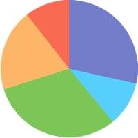

These introductory tips cover the basics of accessible user interface and visual design.

{:.toc .no_toc}
## On this page

{:toc .toc}
* Will be replaced with the ToC

{::nomarkdown}
<%= tip :start %>
{:/}

{:.attach_permalink}
## Provide sufficient contrast between colors

Text needs to have sufficient contrast between foreground and background colors. This includes text on images, buttons, and other elements. A minimum contrast ratio is required by the Web Content Accessibility Guidelines (WCAG) and guidance on how to check contrast ratio is available. This does not apply for logos, or incidental text, such as text that happens to be in a photograph.

Note that "contrast" is used as a short form for the more technically correct term "luminance contrast".

{::nomarkdown}
<%= example :start, :plural %>

  <figure>
    <figcaption>Text with insufficient contrast</figcaption>
    

      
'But they were IN the well,' Alice said to the Dormouse, not choosing to notice this last remark. 'Of course they were', said the Dormouse; '—well in.' 'But they were IN the well,' Alice said to the Dormouse, not choosing to notice this last remark.

    

  </figure>
  <figure>
    <figcaption>Text with sufficient contrast</figcaption>
    

      
'They were learning to draw,' the Dormouse went on, yawning and rubbing its eyes, for it was getting very sleepy; 'and they drew all manner of things—everything that begins with an M—' 'Why with an M?' said Alice. 'Why not?' said the March Hare.

    

  </figure>

<%= example :end %>
{:/}

{::nomarkdown}
<%= learn_more %>
{:/}

* **<acronym title="Web Content Accessibility Guidelines">WCAG</acronym> Requirement**: [<acronym title="Success Criteria">SC</acronym> 1.4.3 Contrast (Minimum)](/WAI/WCAG20/quickref/#visual-audio-contrast-without-color)
* **How To**: [How to check contrast ratio](/WAI/eval/preliminary.html#contrast)
* **Background**: [Understanding <acronym title="Success Criteria">SC</acronym> 1.4.3 Contrast (Minimum)](/TR/UNDERSTANDING-WCAG20/visual-audio-contrast-without-color.html)
* **User Story**: [How a user with "color blindness" experiences the Web](/WAI/intro/people-use-web/stories#shopper)
* **Support Tools**: [List of resources to help determine contrast ratio](/TR/UNDERSTANDING-WCAG20/visual-audio-contrast-contrast.html#visual-audio-contrast-contrast-resources-head)

{::nomarkdown}
<%= learn_more :end %>
{:/}

{::nomarkdown}
<%= tip :end %>
<%= tip :start %>
{:/}

{:.attach_permalink}
## Don't use color alone to signify meaning

Color can be a useful to indicate emphasis or meaning but should not be the only way information is conveyed. Use additional identification that does not rely on color perception when using color to differentiate elements. For example, use an asterisk in addition to color to indicate required form fields, and use labels and patterns to help distinguish areas on graphs and maps.

{::nomarkdown}
<%= example :start, :plural %>

  <figure class="fail">
    <figcaption>Inaccessible pie chart</figcaption>
    
    <ul>
      <li class="super">Superbear</li>
      <li class="aqua">Aquabear</li>
      <li class="bat">Batbear</li>
      <li class="star">Starbear</li>
      <li class="blue">Blue Bear</li>
    </ul>
  </figure>
  <figure class="pass">
    <figcaption>Accessible pie chart</figcaption>
    
    <ul>
      <li class="super">Superbear (28%)</li>
      <li class="aqua">Aquabear (11%)</li>
      <li class="bat">Batbear (31%)</li>
      <li class="star">Starbear (19%)</li>
      <li class="blue">Blue Bear (11%)</li>
    </ul>
  </figure>

<%= example :end %>
{:/}

{::nomarkdown}
<%= learn_more %>
{:/}

* **<acronym title="Web Content Accessibility Guidelines">WCAG</acronym> Requirement**: [<acronym title="Success Criteria">SC</acronym> 1.4.1 Use of Color](/WAI/WCAG20/quickref/#visual-audio-contrast-without-color)
* **Background**: [Understanding <acronym title="Success Criteria">SC</acronym> 1.4.1 Use of Color](/TR/UNDERSTANDING-WCAG20/visual-audio-contrast-without-color.html)
* **User Story**: [How a user with "color blindness" experiences the Web](/WAI/intro/people-use-web/stories#shopper)

{::nomarkdown}
<%= learn_more :end %>
{:/}

{::nomarkdown}
<%= tip :end %>
<%= tip :start %>
{:/}

{:.attach_permalink}
## Ensure interactive elements are easy to identify

Provide distinct styles for interactive elements, such as links, buttons, and other controls, to make them easy to distinguish and identify. Those styles include interaction specific changes of appearance, for example in the event of a mouse hover, keyboard focus, and touch-screen activation. This helps users to identify the state of the element.

{::nomarkdown}
<%= example :start, :plural %>

  <figure>
    <figcaption>Style links to stand out from surrounding text</figcaption>
    

      
Pop into <a href='javascript:return false;'>our Training Centre</a> to pick up an application form.

    

  </figure>
  <figure class="hover">
    <figcaption>Change style when links are hovered over with a mouse</figcaption>
    

      
Pop into <a href=''>our Training Centre</a> to pick up an application form.

    

  </figure>
  <figure class="keyboard">
    <figcaption>Extra styling when links are tabbed to are helpful</figcaption>
    

      
Pop into <a href=''>our Training Centre</a> to pick up an application form.

    

  </figure>
  <figure class="active">
    <figcaption>Strong styles for touched or clicked links can promote action</figcaption>
    

      
Pop into <a href='javascript:return false;'>our Training Centre</a> to pick up an application form.

    

  </figure>

<%= example :end %>
{:/}

{::nomarkdown}
<%= learn_more %>
{:/}

* **<acronym title="Web Content Accessibility Guidelines">WCAG</acronym> Requirement**: [<acronym title="Success Criteria">SC</acronym> 2.4.7 Focus Visible](/WAI/WCAG20/quickref/#navigation-mechanisms-focus-visible)
* **Background**: [Understanding <acronym title="Success Criteria">SC</acronym> 2.4.7 Focus Visible](/TR/UNDERSTANDING-WCAG20/navigation-mechanisms-focus-visible.html)
* **User Story**:
  * [Challenges faced by someone with a limited ability to use a mouse](/WAI/intro/people-use-web/stories#reporter)
  * [Challenges faced by an older user with hand tremors](/WAI/intro/people-use-web/stories#reporter)

{::nomarkdown}
<%= learn_more :end %>
{:/}

{::nomarkdown}
<%= tip :end %>
<%= tip %>
{:/}

{:.attach_permalink}
## Provide clear and consistent navigation options

Ensure page designs include clear and consistent naming, styling and positioning of navigation elements. If your web site consists of many pages, provide more than one method of navigation, such as a breadcrumb navigation, a site search, or a site map. Help users understand where they are on a web page and in a website by providing orientation cues, such as clear headings and, if appropriate, breadcrumbs.

{::nomarkdown}
<%= learn_more %>
{:/}

* **<acronym title="Web Content Accessibility Guidelines">WCAG</acronym> Requirement**: [<acronym title="Success Criteria">SC</acronym> 3.2.3 Consistent Navigation](/WAI/WCAG20/quickref/#consistent-behavior-consistent-locations)
* **Background**: [Understanding <acronym title="Success Criteria">SC</acronym> 3.2.3 Consistent Navigation](/TR/UNDERSTANDING-WCAG20/consistent-behavior-consistent-locations.html)
* **User Story**: [How consistency and navigation can help someone with cognitive difficulties](/WAI/intro/people-use-web/stories#reporter)

{::nomarkdown}
<%= learn_more :end %>
{:/}

{::nomarkdown}
<%= tip :end %>
<%= tip %>
{:/}

{:.attach_permalink}
## Ensure form elements include clearly associated labels

When creating forms, ensure that all fields have an adjacent, descriptive label. For left-to-right languages, labels are usually positioned to the left or above the field, except for checkboxes and radio buttons where it is usually to the right. Avoid having too much distance between labels and associated elements.

{::nomarkdown}
<%= example :start, :plural %>

  <figure class="fail">
    <figcaption>Example of poorly associated labels</figcaption>
    

      <form action="">
        

          <label class="required">E-mail ✻</label>
          <input type="text" id="email3" name="email">
        

        

          <label>Website</label>
          <input type="text" id="website" name="website">
        

        

          <textarea name="comment" id="comment"></textarea>
        

      </form>
    

  </figure>
  <figure class="pass">
    <figcaption>Good example of associated labels</figcaption>
    

      <form action="">
        <legend>Add a comment</legend>
        

          <label class="required" for="email4">Your E-mail ✻</label>
          <input type="text" id="email4" name="email">
        

        

          <label for="website2">Your Website</label>
          <input type="text" id="website2" name="website">
        

        

          <label class="required" for="comment2">Comment ✻</label>
          <textarea name="comment" id="comment2"></textarea>
        

      </form>
    

  </figure>

<%= example :end %>
{:/}

{::nomarkdown}
<%= learn_more %>
{:/}

* **<acronym title="Web Content Accessibility Guidelines">WCAG</acronym> Requirement**: 
  * [<acronym title="Success Criteria">SC</acronym> 3.3.2 Labels or Instructions](/WAI/WCAG20/quickref/#minimize-error-cues)
  * [<acronym title="Success Criteria">SC</acronym> 2.4.6 Headings and Labels](/WAI/WCAG20/quickref/#navigation-mechanisms-descriptive)
* **Background**:
  * [Understanding <acronym title="Success Criteria">SC</acronym> 3.3.2 Labels or Instructions](/TR/UNDERSTANDING-WCAG20/minimize-error-cues.html)
  * [Understanding <acronym title="Success Criteria">SC</acronym> 2.4.6 Headings and Labels](/TR/UNDERSTANDING-WCAG20/navigation-mechanisms-descriptive.html)
* **Tutotial**: [Explains more about the visual position of labels](/WAI/tutorials/forms/labels/#visual-position-of-label-text)
* **User Story**: [How clear labelling can help someone with cognitive difficulties](/WAI/intro/people-use-web/stories#supermarketassistant)

{::nomarkdown}
<%= learn_more :end %>
{:/}

{::nomarkdown}
<%= tip :end %>
<%= tip %>
{:/}

{:.attach_permalink}
## Provide clear feedback

Provide feedback for any page interactions, such as confirmation of form submission, alerting the user when something goes wrong, or notification of changes on the page. Important feedback that requires user action should be presented in a prominent style. Any instructions should be clear and easy to follow. 
 
{::nomarkdown}
<%= example :start, nil %>

  <figure>
    <figcaption>Example of prominent errors</figcaption>
    

      

        
There are two problems.

        <ol class="fa-ul">
          <li id="error_email"><a href="javascript:document.getElementById('email5').focus()">The E-mail you provided is not valid</a></li>
          <li id="error_comment"><a href="javascript:document.getElementById('comment3').focus()">A Comment is required</a></li>
        </ol>
      

      <form action="">
        <legend>Add a comment</legend>
        

          <label for="name5">Name</label>
          <input type="text" id="name5" name="name" value="Superbear">
        

        

          <label class="required" for="email5"> E-mail ✻</label>
          <input type="text" id="email5" name="email" value="superbear@@hq.space" aria-invalid="true" aria-describedby="error_email">
        

        

          <label for="website3">Website</label>
          <input type="text" id="website3" name="website">
        

        

          <label class="required" for="comment3"> Comment ✻</label>
          <textarea name="comment" id="comment3" aria-invalid="true" aria-describedby="error_comment"></textarea>
        

      </form>
    

  </figure>

<%= example :end %>
{:/}

{::nomarkdown}
<%= learn_more %>
{:/}

* **<acronym title="Web Content Accessibility Guidelines">WCAG</acronym> Requirement**: [<acronym title="Success Criteria">SC</acronym> 3.3.1 Error Identification](/WAI/WCAG20/quickref/#minimize-error-identified)
* **Tutorial**: [Shows how feedback can be provided in different ways](/WAI/tutorials/forms/notifications/)
* **Background**: [Understanding <acronym title="Success Criteria">SC</acronym> 3.3.1 Error Identification](/TR/UNDERSTANDING-WCAG20/minimize-error-identified.html)
* **User Story**: [How making important content easily identifiable can help](/WAI/intro/people-use-web/stories#classroomstudent)

{::nomarkdown}
<%= learn_more :end %>
{:/}

{::nomarkdown}
<%= tip :end %>
<%= tip %>
{:/}

{:.attach_permalink}
## Use headings and spacing to group related content

Content design benefits from clear headings to chunk up content. Use whitespace to reduce clutter, make related content or elements more apparent, and make content more scannable.

{::nomarkdown}
<%= learn_more %>
{:/}

* **<acronym title="Web Content Accessibility Guidelines">WCAG</acronym> Requirement**: [<acronym title="Success Criteria">SC</acronym> 2.4.6 Headings and Labels](/WAI/WCAG20/quickref/#navigation-mechanisms-descriptive)
* **Tutorial**: [Discusses different ways to use headings to provide meaning to content](/WAI/tutorials/page-structure/headings/)
* **Background**: [Understanding <acronym title="Success Criteria">SC</acronym> 2.4.6 Headings and Labels](/TR/UNDERSTANDING-WCAG20/navigation-mechanisms-descriptive.html)
* **User Story**: [Describes how headings can be helpful for navigation](/WAI/intro/people-use-web/stories#accountant)

{::nomarkdown}
<%= learn_more :end %>
{:/}

{::nomarkdown}
<%= tip :end %>
<%= tip %>
{:/}

{:.attach_permalink}
## Create designs for different viewport sizes

Consider how page information is presented in different sized viewports, such as mobile phones or zoomed browser windows. Position and presentation of main elements, such as header and navigation can be changed to make best use of the space. Ensure text size and line width are set to maximize readability and legibility.

{::nomarkdown}
<%= example %>

  <figure>
    <figcaption>Example of content displayed in different viewport sizes</figcaption>
    

      
      
      
Browser display uses multiple columns for primary content, visible navigation options, and visible secondary information.

      
Mobile display uses single column for primary content, navigation options are revealed using an icon, and secondary information is also revealed via icon.

    

  </figure>

<%= example :end %>
{:/}

{::nomarkdown}
<%= learn_more %>
{:/}

* **<acronym title="Web Content Accessibility Guidelines">WCAG</acronym> Requirement**: [<acronym title="Success Criteria">SC</acronym> 1.4.4 Resize text](/WAI/WCAG20/quickref/#visual-audio-contrast-scale)
* **Background**: [Understanding <acronym title="Success Criteria">SC</acronym> 1.4.4 Resize text](/TR/UNDERSTANDING-WCAG20/visual-audio-contrast-scale.html)
* **User Story**: [Describes how alternative views of zoomed pages can be helpful](/WAI/intro/people-use-web/stories#retiree)

{::nomarkdown}
<%= learn_more :end %>
{:/}

{::nomarkdown}
<%= tip :end %>
<%= tip %>
{:/}

{:.attach_permalink}
## Provide a text alternative for images

Provide a text description to communicate what information or function images are being used for in designs. Images can be used in many different ways, such as to convey information, as decorative support, or in functional ways. Consider what the images is being selected to do and provide text to describe that purpose.

{::nomarkdown}
<%= example %>

[... Text descriptions for: ... ]
[... Home icon with functional text 'Home' ...]

[... Photo of snow vista with descriptive text 'Used to evoke a sense of desire in snowboarders' ...]

<%= example :end %>
{:/}

{::nomarkdown}
<%= learn_more %>
{:/}

* **<acronym title="Web Content Accessibility Guidelines">WCAG</acronym> Requirement**: [<acronym title="Success Criteria">SC</acronym> 1.1.1 Non-text Content](/WAI/WCAG20/quickref/#qr-text-equiv-all)
* **Tutotial**: [Demonstrates how to provide appropriate text alternatives based on the purpose of the image](/WAI/tutorials/images/)
* **Background**: [Understanding <acronym title="Success Criteria">SC</acronym> 1.1.1 Non-text Content](/TR/UNDERSTANDING-WCAG20/text-equiv-all.html)
* **User Story**: [Describes the value of text alternatives to a blind user](/WAI/intro/people-use-web/stories#accountant)

{::nomarkdown}
<%= learn_more :end %>
{:/}

{::nomarkdown}
<%= tip :end %>
<%= tip %>
{:/}

{:.attach_permalink}
## Learn more about accessibility

These tips are important points to consider when designing accessible websites, but there is always more to learn. The following resources will help you find out more about accessibility, why it is important, and what guidelines exist to help support people with disabilities accessing the web.

{::nomarkdown}
<%= learn_more %>
{:/}

* [<abbr title="World Wide Web Consortium">W3C</abbr> Accessibility](/standards/webdesign/accessibility): <abbr title="World Wide Web Consortium">W3C</abbr> introduces accessibility and provides links to many helpful resources
* [Accessibility Principles](/WAI/intro/people-use-web/principles): Provides an introduction to the web accessibility requirements referenced in the international accessibility standards from W3C Web Accessibility Initiative
* [How people with disabilities use the web](/WAI/intro/people-use-web): Uses real-life examples to introduce accessibility, and explores tools and approaches that help, and barriers encountered 
* [Web Accessibility Tutorials](/WAI/tutorials/): Shows you how to develop web content that is accessible to people with disabilities, and that provides a better user experience for everyone
* [Before and After Demonstration](/WAI/demos/bad/): Example accessible and inaccessible websites that share the same visual design, including annotations that highlight key accessibility barriers and repairs

{::nomarkdown}
<%= learn_more :end %>
{:/}

{::nomarkdown}
<%= tip :end %>
{:/}
