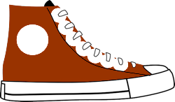

These tips introduce some basic considerations to help you get started developing web content that is more accessible to people with disabilities. The tips are written as good practice rather than actual requirements. Refer to the related Web Content Accessibility Guidelines (WCAG) Success Criteria linked from each tip to understand the requirements, and refer to the background and training material to learn more about web accessibility. 

{:.toc .no_toc}
## On this page

{:toc .toc}
* Will be replaced with the ToC

{::nomarkdown}
<%= tip %>
{:/}

{:.attach_permalink}
## Associate a label with every form control

Use a `for` attribute on the `<label>` element linked to the `id` attribute of the form element, or using <abbr title="Accessible Rich Internet Applications">WAI-ARIA</abbr> attributes. In specific situations it may be acceptable to hide `<label>` elements visually, but in most cases labels are needed to help all readers understand the required input.

{::nomarkdown}
<%= example 'Using <code>for</code> and <code>id</code> attributes' %>

  <figure>
    <% html_example do %>
      <label for="username">Username</label>
      <input id="username" type="text" name="username">
    <% end %>
  </figure>

<%= example :end %>
{:/}

{::nomarkdown}
<%= related_resources %>
{:/}

* **Related WCAG Requirement**
  * [3.3.2 Labels or Instructions](/WAI/WCAG20/quickref/#minimize-error-cues) ([Understanding 3.3.2](/TR/UNDERSTANDING-WCAG20/minimize-error-cues.html))
* **Tutorial**
  * [Labelling Controls](/WAI/tutorials/forms/labels/)

{::nomarkdown}
<%= related_resources :end %>
{:/}

{::nomarkdown}
<%= tip :end %>
<%= tip %>
{:/}

{:.attach_permalink}
## Include alternative text for images

Ensure that alternative text for images is added to all informational and functional images. Decorative images should have empty alternative text, `alt=""`, or should be included using <abbr>CSS</abbr>. Text alternatives are usually provided by those responsible for written content. 

{::nomarkdown}
<%= related_resources %>
{:/}

* **Related WCAG Requirement**
  * [1.1.1 Non-text Content](/WAI/WCAG20/quickref/#qr-text-equiv-all) ([Understanding 1.1.1](/TR/UNDERSTANDING-WCAG20/qr-text-equiv-all.html))
* **Tutorial**
  * [Images](/WAI/tutorials/images/)
* **User Story**
  * [Describes the value of text alternatives to a blind user](/WAI/intro/people-use-web/stories#accountant)

{::nomarkdown}
<%= related_resources :end %>
{:/}

{::nomarkdown}
<%= tip :end %>
<%= tip %>
{:/}

{:.attach_permalink}
## Identify page language and language changes

Indicate the primary language of every page by using the `lang` attribute in the `html` tag, for example `<html lang="en">`. Use the `lang` attribute on specific elements when the language of the element differs from the rest of the page.

{::nomarkdown}
<%= related_resources %>
{:/}

* **Related WCAG Requirement**
  * [3.1.1 Language of Page](/WAI/WCAG20/quickref/#meaning-doc-lang-id) ([Understanding 3.1.1](/TR/UNDERSTANDING-WCAG20/meaning-doc-lang-id.html))
  * [3.1.2 Language of Parts](/WAI/WCAG20/quickref/#meaning-other-lang-id) ([Understanding 3.1.2](/TR/UNDERSTANDING-WCAG20/meaning-other-lang-id.html))
* **How To**
  * [Declaring language in HTML](/International/questions/qa-html-language-declarations)

{::nomarkdown}
<%= related_resources :end %>
{:/}

{::nomarkdown}
<%= tip :end %>
<%= tip %>
{:/}

{:.attach_permalink}
## Use mark-up to convey meaning and structure

Use appropriate mark-up for headings, lists, tables, etc. HTML5 provides additional elements, such as `<nav>` and `<aside>`, to better structure your content. <abbr>WAI-ARIA</abbr> roles can provide additional meaning, for example, using `role="search"` to identify search functionality. Work with designers and content writers to agree on meanings and then use them consistently.

{::nomarkdown}
<%= example 'Using HTML to provide structure and meaning' %>

  <figure>
    <% html_example do %>
    <section>
      <article>
        <h2>Superbear saves the day</h2>
        <time>7 Aug 2015</time>
        
The city's favorite bear yet again proves his mettle by rescuing a young cat from a tree. Witnesses say that Superbear's efforts were not appreciated by the feline, who inflicted some minor scratch wounds on his rescuer.

        <aside>
          <h3>Related Articles</h3>
          <ul>
            <li><a href="#">Bear receives key to city</a></li>
            <li><a href="#">Superbear stands for mayor</a></li>
          </ul>
        </aside>
      </article>
    </section>
    <% end %>
  </figure>

<%= example :end %>
<%= example 'Search field using <abbr>WAI-ARIA</abbr>' %>

  <figure>
    <% html_example do %>
    <form action="">
      

        <label for="search">Search for</label>
        <input type="search" id="search" aria-describedby="search-help">
        
Search records by customer id or name

        <button type="submit">Go</button>
      

    </form>
    <% end %>
  </figure>

<%= example :end %>
{:/}

{::nomarkdown}
<%= related_resources %>
{:/}

* **Related WCAG Requirement**
  * [1.3.1 Info and Relationships](/WAI/WCAG20/quickref/#content-structure-separation-programmatic) ([Understanding 1.3.1](/TR/UNDERSTANDING-WCAG20/content-structure-separation-programmatic.html))
* **Tutorial**
  * [Page Structure](/WAI/tutorials/page-structure/)
  * [Tables](/WAI/tutorials/tables/)
* **User Story**
  * [Describes how structural information helps a screen reader user](/WAI/intro/people-use-web/stories#accountant)

{::nomarkdown}
<%= related_resources :end %>
{:/}

{::nomarkdown}
<%= tip :end %>
<%= tip %>
{:/}

{:.attach_permalink}
## Help users avoid and correct mistakes

Provide clear instructions, error messages, and notifications, to help users. When an error occurs, help users find where the problem is, make the message as specific as possible, and indicate how to fix the problem. Try to reduce the chances of errors occurring in the first place, for example, be as forgiving of format as possible when processing user input.

{::nomarkdown}
<%= example 'Australian phone number field with forgiving validation' %>

  <figure>
    <% html_example do %>
      <label for="phone">Phone</label>
      <input id="phone" name="phone" type="tel" pattern="^(\(?0[1-9]{1}\)?)?[0-9 -]*$" aria-describedby="phone-desc">
      
For example, (02) 1234 1234

    <% end %>
  </figure>

<%= example :end %>
{:/}

{::nomarkdown}
<%= related_resources %>
{:/}

* **Related WCAG Requirement**
  * [3.3.1 Error Identifications](/WAI/WCAG20/quickref/#qr-minimize-error-identified) ([Understanding 3.3.1](/TR/UNDERSTANDING-WCAG20/qr-minimize-error-identified.html))
* **Tutorial**
  * [Validating Input](/WAI/tutorials/forms/validation/)
* **User Story**
  * [Describes how helpful errors help a user with dyslexia](/WAI/intro/people-use-web/stories#classroomstudent)

{::nomarkdown}
<%= related_resources :end %>
{:/}

{::nomarkdown}
<%= tip :end %>
<%= tip %>
{:/}

{:.attach_permalink}
## Reflect the reading order in the code order

Ensure that the order of elements in the code matches the logical order of the information presented. One way to check this is to remove <abbr>CSS</abbr> styling and review that the order of the content makes sense.

{::nomarkdown}
<%= example 'Two approaches to coding presentation of a product' %>

  <article class="product">
    <h3 class="name">Space trainers</h3>
    
    
Space trainer for a classic and stylish look.

    
<a href="javascript:return false"><i class="fa fa-cart-plus"></i> Add to cart</a>

  </article>
  

    <figure>
      <figcaption>✘ Code order does not reflect logical reading order</figcaption>
      

        
Code Snippet:

        <% code('html') do %>

<h3>Space trainers</h3>

Space...

<a href="...">Add to cart</a>
        <% end %>
      

    </figure>
    
    <figure>
      <figcaption>✓ Code order reflects logical reading order</figcaption>
      

        
Code Snippet:

        <% code('html') do %>
<h3>Space trainers</h3>

Space...

<a href="...">Add to cart</a>
        <% end %>
      

    </figure>
  

<%= example :end %>
{:/}

{::nomarkdown}
<%= related_resources %>
{:/}

* **Related WCAG Requirement**
  * [1.3.2 Meaningful Sequence](/WAI/WCAG20/quickref/#qr-minimize-error-identified) ([Understanding 1.3.2](/TR/UNDERSTANDING-WCAG20/qr-minimize-error-identified.html))

{::nomarkdown}
<%= related_resources :end %>
{:/}

{::nomarkdown}
<%= tip :end %>
<%= tip %>
{:/}

{:.attach_permalink}
## Write code that adapts to the user's technology

Use responsive design to adapt the display to different zoom states and viewport sizes, such as on mobile devices and tablets. When font size is increased by at least 200%, avoid horizontal scrolling and prevent any clipping of content. Use progressive enhancement to help ensure that core functionality and content is available regardless of technology being used.

{::nomarkdown}
<%= example 'Using media queries to adapt navigation' %>

  <figure>
    

      
Code Snippet:

      

        <% code 'css' do %>
/* On narrow viewports, make the navigation full width */
@media screen and (min-width: 25em) {
  #nav {
    float: none;
    width: auto;
  }
  #main {
    margin-left: 0;
  }
}
      <% end %>
      <% code 'css' do %>
/* On wider viewports, put the navigation on the left */
@media screen and (min-width: 43em) {
  #nav {
    float: left;
    width: 24%;
  }
  #main {
    margin-left: 27%;
  }
}
      <% end %>
    

  

  </figure>

<%= example :end %>
{:/}

{::nomarkdown}
<%= related_resources %>
{:/}

* **Related WCAG Requirement**
  * [1.4.4 Resize text](/WAI/WCAG20/quickref/#visual-audio-contrast-scale) ([Understanding 1.4.4](/TR/UNDERSTANDING-WCAG20/visual-audio-contrast-scale.html))
  * [3.2.4 Consistent Identification](/WAI/WCAG20/quickref/#consistent-behavior-consistent-functionality) ([Understanding 3.2.4](/TR/UNDERSTANDING-WCAG20/consistent-behavior-consistent-functionality.html))
* **Background**
  * [Small Screen Size](/TR/mobile-accessibility-mapping/#h-small-screen-size)
* **User Story**
  * [Describes how alternative views of zoomed pages can be helpful](/WAI/intro/people-use-web/stories#retiree)

{::nomarkdown}
<%= related_resources :end %>
{:/}

{::nomarkdown}
<%= tip :end %>
<%= tip %>
{:/}

{:.attach_permalink}
## Provide meaning for non-standard interactive elements 

Use <abbr title="Accessible Rich Internet Applications">WAI-ARIA</abbr> to provide information on function and state for custom widgets, such as accordions and custom-made buttons. For example, `role="navigation"` and `aria-expanded="true"`. Additional code is required to implement the behavior of such widgets, such as expanding/collapsing content or how the widget responds to keyboard events.

{::nomarkdown}
<%= example 'Menu function and state identified using WAI-ARIA' %>

  <figure>
      

        
Code Snippet:

        <% code 'html' do %>
<nav aria-label="Main Navigation" role="navigation">
	<ul>
		<li><a href="...">Home</a></li>
		<li><a href="...">Shop</a></li>
		<li class="has-submenu">
			<a aria-expanded="false" aria-haspopup="true" href="#">SpaceBears</a>
			<ul>
					<li><a href="...">SpaceBear 6</a></li>
					<li><a href="...">SpaceBear 6 Plus</a></li>
			</ul>
		</li>
		<li><a href="...">MarsCars</a></li>
		<li><a href="...">Contact</a></li>
	</ul>
</nav>
      <% end %>
      

  </figure>

<%= example :end %>
{:/}

{::nomarkdown}
<%= related_resources %>
{:/}

* **Related WCAG Requirement**
  * [4.1.2 Name, Role, Value](/WAI/WCAG20/quickref/#ensure-compat-rsv) ([Understanding 4.1.2](/TR/UNDERSTANDING-WCAG20/ensure-compat-rsv.html))
* **Background**
  * [Notes on Using ARIA in HTML](/TR/aria-in-html/)  

{::nomarkdown}
<%= related_resources :end %>
{:/}

{::nomarkdown}
<%= tip :end %>
<%= tip %>
{:/}

{:.attach_permalink}
## Ensure that all interactive elements are keyboard accessible

Think about keyboard access, especially when developing interactive elements, such as menus, mouseover information, collapsable accordions, or media players. Use `tabindex="0"` to add an element that does not normally receive focus, such as `
` or ``, into the navigation order when it is being used for interaction. Use scripting to capture and respond to keyboard events.

{::nomarkdown}
<%= example 'Keyboard accessible menu icon' %>

  <figure>
    

      

        
Rendered:

        
<i class="fa fa-bars"></i> Menu

        

          <ul>
            <li><a href="javascript:return false">About</a></li>
            <li><a href="javascript:return false">News</a></li>
            <li><a href="javascript:return false">Tickets</a></li>
            <li><a href="javascript:return false">Fun</a></li>
          </ul>
        

      

      

        
Code Snippet:

        <% code 'javascript' do %>
var buttonExample = document.getElementById('example-button');

buttonExample.addEventListener('keydown', function(e) {
  // Toggle the menu when RETURN is pressed
  if(e.keyCode && e.keyCode == 13) {
    toggleMenu(document.getElementById('example-button-menu'));
  }
});

buttonExample.addEventListener('click', function(e) {
// Toggle the menu on mouse click
  toggleMenu(document.getElementById('example-button-menu'));
});
      <% end %>
      

    

  </figure>

<%= example :end %>
{:/}

{::nomarkdown}
<%= related_resources %>
{:/}

* **Related WCAG Requirement**
  * [2.1.1 Keyboard](/WAI/WCAG20/quickref/#keyboard-operation-keyboard-operable) ([Understanding 2.1.1](/TR/UNDERSTANDING-WCAG20/keyboard-operation-keyboard-operable.html))
* **User Story**
  * [Describes how a user with RSI needs keyboard support](/WAI/intro/people-use-web/stories#reporter)

{::nomarkdown}
<%= related_resources :end %>
{:/}

{::nomarkdown}
<%= tip :end %>
<%= tip %>
{:/}

{:.attach_permalink}
## Avoid CAPTCHA where possible

CAPTCHAs create problems for many people. There are other means of verifying that user input was generated by a human that are easier to use, such as automatic detection or interface interactions. If CAPTCHA really needs to be included, ensure that it is simple to understand and includes alternatives for users with disabilities, such as:

* Providing more than two ways to solve the CAPTCHAs
* Providing access to a human representative who can bypass CAPTCHA
* Not requiring CAPTCHAs for authorized users. 

{::nomarkdown}
<%= related_resources %>
{:/}

* **Related WCAG Requirement**
  * [1.1.1 Non-text Content](/WAI/WCAG20/quickref/#text-equiv-all) ([Understanding 1.1.1](/TR/UNDERSTANDING-WCAG20/text-equiv-all.html))

{::nomarkdown}
<%= related_resources :end %>
{:/}

{::nomarkdown}
<%= tip :end %>
<%= tip %>
{:/}

{:.attach_permalink}
## Learn more about accessibility

These tips are a few things you need to consider for web accessibility. The following resources help you learn why accessibility is important, and about guidelines for making the web more accessible to people with disabilities.

* [Accessibility Introduction](/standards/webdesign/accessibility) &mdash; Introduces accessibility and provides links to many helpful resources
* [Accessibility Principles](/WAI/intro/people-use-web/principles) &mdash; An introduction to the <abbr>WCAG</abbr> requirements
* [How people with disabilities use the web](/WAI/intro/people-use-web) &mdash; Real-life examples of the benefits of accessibility for people with disabilities
* [Web Accessibility Tutorials](/WAI/tutorials/) &mdash; Shows you how to develop web content that is accessible to people with disabilities
* [Before and After Demonstration](/WAI/demos/bad/) &mdash; Example accessible and inaccessible websites that share the same visual design, with annotations that highlight key accessibility barriers and repairs, and evaluation reports for <abbr>WCAG</abbr> 2.0
* [<abbr>WCAG</abbr> Quick Reference](/WAI/WCAG20/quickref/) &mdash; customizable reference of all <abbr>WCAG</abbr> 2.0 requirements and techniques
* [Web Accessibility Evaluation Tools List](/WAI/ER/tools/) &mdash; Provides a range of tools to help explore the accessibility of code
* [<abbr>WAI-ARIA</abbr> Overview](/WAI/intro/aria) &mdash; Introduction to <abbr>WAI-ARIA</abbr> with links to all the specifications

{::nomarkdown}
<%= tip :end %>
{:/}
