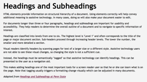
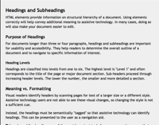

These introductory tips cover the basics of writing web accessible content.

{:.toc .no_toc}
## On this page

{:toc .toc}
* Will be replaced with the ToC

{::nomarkdown}
<%= tip %>
{:/}

{:.attach_permalink}
## Provide informative, unique page titles

{::nomarkdown}
<%= related_issues 161 %>
{:/}

Provide unique titles to describe the page content and purpose, and distinguishes it from other pages. If including the organization's name in the title, it should usually go at the end. For pages that are part of a group, such as a multi-step process, include the stage in the page title.

{::nomarkdown}
<%= example %>

  <figure>
    <figcaption>Home page title</figcaption>
    <svg version="1.1" width="462" height="27" aria-labelledby="page-title-1" role="img">
      <g transform="scale(1.2)">
        <title id="page-title-1">Home page title</title>
        <path class="banner" d="M 0 9.75 L 0 14.8125 L 0 21.625 L 384.5 21.625 L 384.5 14.8125 L 384.5 9.75 L 384.5 3.25 C 384.5 1.59314575 383.15685 .25 381.5 .25 L 3 .25 C 1.34314575 .25 0 1.59314575 0 3.25 Z" fill="#f5f5f5"/>
        <text transform="translate(10 15)">Space Teddy Inc.</text>
        <g transform="translate(333 4)">
        	<rect x="0" y="9.5" width="10" height="1.5"/>
	        <path d="M 24 10 L 17 10 L 17 4 L 24 4 Z M 16 11 L 25 11 L 25 3 L 16 3 Z"/>
        	<path d="M 41 3 L 40 2 L 36 6 L 32 2 L 31 3 L 35 7 L 31 11 L 32 12 L 36 8 L 40 12 L 41 11 L 37 7 Z"/>
        </g>
      </g>
    </svg>
  </figure>
  <figure>
    <figcaption>Sub-page title with site title included</figcaption>
    <svg version="1.1" width="462" height="27" aria-labelledby="page-title-2" role="img">
      <g transform="scale(1.2)">
        <title id="page-title-2">Sub-page title with site title included</title>
        <path class="banner" d="M 0 9.75 L 0 14.8125 L 0 21.625 L 384.5 21.625 L 384.5 14.8125 L 384.5 9.75 L 384.5 3.25 C 384.5 1.59314575 383.15685 .25 381.5 .25 L 3 .25 C 1.34314575 .25 0 1.59314575 0 3.25 Z" fill="#f5f5f5"/>
        <text transform="translate(10 15)">Latest News &bull; Space Teddy Inc.</text>
        <g transform="translate(333 4)">
        	<rect x="0" y="9.5" width="10" height="1.5"/>
	        <path d="M 24 10 L 17 10 L 17 4 L 24 4 Z M 16 11 L 25 11 L 25 3 L 16 3 Z"/>
        	<path d="M 41 3 L 40 2 L 36 6 L 32 2 L 31 3 L 35 7 L 31 11 L 32 12 L 36 8 L 40 12 L 41 11 L 37 7 Z"/>
        </g>
      </g>
    </svg>
  </figure>
  <figure>
    <figcaption>Title of page in a process</figcaption>
    <svg version="1.1" width="462" height="27" aria-labelledby="page-title-3" role="img">
      <g transform="scale(1.2)">
        <title id="page-title-3">Title of page in a process</title>
        <path class="banner" d="M 0 9.75 L 0 14.8125 L 0 21.625 L 384.5 21.625 L 384.5 14.8125 L 384.5 9.75 L 384.5 3.25 C 384.5 1.59314575 383.15685 .25 381.5 .25 L 3 .25 C 1.34314575 .25 0 1.59314575 0 3.25 Z" fill="#f5f5f5"/>
        <text transform="translate(10 15)">Buy Your Bear (Step 1 of 3) &bull; Space Teddy Inc.</text>
        <g transform="translate(333 4)">
        	<rect x="0" y="9.5" width="10" height="1.5"/>
	        <path d="M 24 10 L 17 10 L 17 4 L 24 4 Z M 16 11 L 25 11 L 25 3 L 16 3 Z"/>
        	<path d="M 41 3 L 40 2 L 36 6 L 32 2 L 31 3 L 35 7 L 31 11 L 32 12 L 36 8 L 40 12 L 41 11 L 37 7 Z"/>
        </g>
      </g>
    </svg>
  </figure>

<%= example :end %>
{:/}

{::nomarkdown}
<%= learn_more %>
{:/}

* **<abbr title="Web Content Accessibility Guidelines">WCAG</abbr> Requirement**: [<abbr title="Success Criteria">SC</abbr> 2.4.2 Page Titled](/WAI/WCAG20/quickref/#navigation-mechanisms-title)
* **How To**: [Provide descriptive titles for Web pages](/TR/2014/NOTE-WCAG20-TECHS-20140916/G88)
* **Background**: [Understanding <abbr title="Success Criteria">SC</abbr> 2.4.2 Page Titled](/TR/UNDERSTANDING-WCAG20/navigation-mechanisms-title.html)

{::nomarkdown}
<%= learn_more :end %>
{:/}

{::nomarkdown}
<%= tip :end %>
<%= tip %>
{:/}

{:.attach_permalink}
## Use headings to convey meaning and structure 

{::nomarkdown}
<%= related_issues 131, 62 %>
{:/}

Use clear and simple headings to group related paragraphs. Headings should usually be short and introduce or summarize a section of text.

{::nomarkdown}
<%= example :start, :plural %>

  <figure>
    <figcaption><a id="no-headings-modal" class="modal-open" href="#no-headings-modal-holder"> Content presented without headings</a></figcaption>
    

      

        <h2 id="no-headings-modal-title">Example: Headings and Subheadings</h2>

        
<abbr>HTML</abbr> elements provide information on structural hierarchy of a document. Using elements correctly will help convey additional meaning to assistive technology. In many cases, doing so will also make your document easier to edit.

        
For documents longer than three or four paragraphs, headings and subheadings are important for usability and accessibility. They help readers to determine the overall outline of a document and to navigate to specific information of interest.

      
        
Headings are classified into levels from one to six. The highest level is "Level 1" and often corresponds to the title of the page or major document section. Sub-headers proceed through increasing header levels. The lower the number, the smaller and more detailed a section.

        
Visual readers identify headers by scanning pages for text of a larger size or a different style. Assistive technology users are not able to see these visual changes, so changing the style is not a sufficient cue.

        
Instead, the headings must be semantically "tagged" so that assistive technology can identify headings. This can be presented to the user as a navigation aid.

        
This makes adding headings one of the most important tools for a screen reader user so that he or she can learn what is on the page. Note that tagging usually triggers a formatting change visually which can be adjusted in many documents.

      
        <cite>Adapted from <a href="http://accessibility.psu.edu/headings/">Headings and Subheadings at Penn State</a></cite>
      

    

  </figure>
  <figure>
    <figcaption><a id="headings-modal" class="modal-open" href="#headings-modal-holder"> Headings used to split content and group topics</a></figcaption>
    
    

      

        <h2 id="headings-modal-title">Example: Headings and Subheadings</h2>
      
        
<abbr>HTML</abbr> elements provide information on structural hierarchy of a document. Using elements correctly will help convey additional meaning to assistive technology. In many cases, doing so will also make your document easier to edit.

        <h3>Example: Purpose of Headings</h3>
      
        
For documents longer than three or four paragraphs, headings and subheadings are important for usability and accessibility. They help readers to determine the overall outline of a document and to navigate to specific information of interest.

      
        <h4>Example: Heading Levels</h4>
      
        
Headings are classified into levels from one to six. The highest level is "Level 1" and often corresponds to the title of the page or major document section. Sub-headers proceed through increasing header levels. The lower the number, the smaller and more detailed a section.

        <h3>Example: Meaning vs. Formatting</h3>
      
        
Visual readers identify headers by scanning pages for text of a larger size or a different style. Assistive technology users are not able to see these visual changes, so changing the style is not a sufficient cue.

        
Instead, the headings must be semantically "tagged" so that assistive technology can identify headings. This can be presented to the user as a navigation aid.

        
This makes adding headings one of the most important tools for a screen reader user so that he or she can learn what is on the page. Note that tagging usually triggers a formatting change visually which can be adjusted in many documents.

      
        <cite>Adapted from <a href="http://accessibility.psu.edu/headings/">Headings and Subheadings at Penn State</a></cite>
      

    

  </figure>

<%= example :end %>
{:/}

{::nomarkdown}
<%= learn_more %>
{:/}

* **<abbr title="Web Content Accessibility Guidelines">WCAG</abbr> Requirement**:
  * [<abbr title="Success Criteria">SC</abbr> 2.4.6 Headings and Labels](/WAI/WCAG20/quickref/#navigation-mechanisms-descriptive)
  * [<abbr title="Success Criteria">SC</abbr> 1.3.1 Info and Relationships](/WAI/WCAG20/quickref/#content-structure-separation-programmatic)
* **How To**:
  * [Provide descriptive headings](/TR/2014/NOTE-WCAG20-TECHS-20140916/G130)
  * [Organize a page using headings](/TR/2014/NOTE-WCAG20-TECHS-20140916/G141)
* **Background**:
  * [Understanding <abbr title="Success Criteria">SC</abbr> 2.4.6 Headings and Labels](/TR/UNDERSTANDING-WCAG20/navigation-mechanisms-descriptive.html)
  * [Understanding <abbr title="Success Criteria">SC</abbr> 1.3.1 Info and Relationships](/TR/UNDERSTANDING-WCAG20/content-structure-separation-programmatic.html)
* **User Story**: [How a screen reader user uses headings to navigate](/WAI/intro/people-use-web/stories#accountant)

{::nomarkdown}
<%= learn_more :end %>
{:/}

{::nomarkdown}
<%= tip :end %>
<%= tip %>
{:/}

{:.attach_permalink}
##  Keep content clear and concise 

{::nomarkdown}
<%= related_issues 129 %>
{:/}

Write in short, clear sentences and paragraphs, as appropriate for the context. Front-load important messages. Split complex prose into a few short sentences. Try and keep paragraphs to a single idea.
 
{::nomarkdown}
<%= example %>

  <figure>
    <figcaption>Complex text</figcaption>
    

      
In the event of a vehicular collision, a company assigned representative will investigate to ascertain the cause and extent of damages to property belonging to the parties involved. Once cause, damages, and responsibility have been established, we will assign monetary remuneration accordingly.

    

  </figure>
  <figure>
    <figcaption>Clear and simple text</figcaption>
    

      
If you are involved in a car accident, an agent will investigate. Those findings will determine the payment of claims.

    

  </figure>

<%= example :end %>
{:/}

{::nomarkdown}
<%= learn_more %>
{:/}

* **<abbr title="Web Content Accessibility Guidelines">WCAG</abbr> Requirement**: [<abbr title="Success Criteria">SC</abbr> 3.1.5 Reading Level](/WAI/WCAG20/quickref/#meaning-supplements)
* **How To**: [Make the text easier to read](/TR/2014/NOTE-WCAG20-TECHS-20140916/G153)
* **Background**: [Understanding <abbr title="Success Criteria">SC</abbr> 3.1.5 Reading Level](/TR/UNDERSTANDING-WCAG20/meaning-supplements.html)
* **User Story**: [User with reading disabilities benefits from easy to read text](/WAI/intro/people-use-web/stories#classroomstudent)

{::nomarkdown}
<%= learn_more :end %>
{:/}

{::nomarkdown}
<%= tip :end %>
<%= tip %>
{:/}

{:.attach_permalink}
## Avoid using overly complex words and phrases

{::nomarkdown}
<%= related_issues 130 %>
{:/}

Avoid using words more complicated than the audience needs. Some topics may require complex terminology, such as medical or engineering texts, but simpler forms may still be possible. Provide a glossary when content includes unfamiliar terms. 

{::nomarkdown}
<%= example %>
{:/}

[... Example using medical terminology against layman terminology... ]

{::nomarkdown}
<%= example :end %>
{:/}

{::nomarkdown}
<%= learn_more %>
{:/}

* **<abbr title="Web Content Accessibility Guidelines">WCAG</abbr> Requirement**: [<abbr title="Success Criteria">SC</abbr> 3.1.3 Unusual Words](/WAI/WCAG20/quickref/#meaning-idioms)
* **Background**: [Understanding <abbr title="Success Criteria">SC</abbr> 3.1.3 Unusual Words](/TR/UNDERSTANDING-WCAG20/meaning-idioms.html)

{::nomarkdown}
<%= learn_more :end %>
{:/}

{::nomarkdown}
<%= tip :end %>
<%= tip %>
{:/}

{:.attach_permalink}
## Make link text meaningful

Write link text so that it would make sense out of context. Link text should describe the content of the link target in a meaningful way. Avoid using link text such as 'click here', 'find out more', or 'read more'. Indicate the document type and approximate size in the link text when the link target is not HTML. 

{::nomarkdown}
<%= example :start, :plural %>

  <figure>
    <figcaption>Link text with no out of context meaning</figcaption>
    

      
For more information on device independence, <a href="javascript:return false">click here</a>.

    

  </figure>
  <figure>
    <figcaption>Link text that has meaning out of context</figcaption>
    

      
Read more <a href="javascript: return false">about device independence</a>.

    

  </figure>

<%= example :end %>
{:/}

{::nomarkdown}
<%= learn_more %>
{:/}

* **<abbr title="Web Content Accessibility Guidelines">WCAG</abbr> Requirement**:
  * [<abbr title="Success Criteria">SC</abbr> 2.4.4 Link Purpose (In Context)](/WAI/WCAG20/quickref/#navigation-mechanisms-refs)
  * [<abbr title="Success Criteria">SC</abbr> 2.4.9 Link Purpose (Link Only)](/WAI/WCAG20/quickref/#navigation-mechanisms-link)
* **How To**: [Provide link text that describes the purpose of a link](/TR/2014/NOTE-WCAG20-TECHS-20140916/G91)
* **Background**:
  * [Understanding <abbr title="Success Criteria">SC</abbr> 2.4.4 Link Purpose (In Context)](/TR/UNDERSTANDING-WCAG20/navigation-mechanisms-refs.html)
  * [Understanding <abbr title="Success Criteria">SC</abbr> 2.4.9 Link Purpose (Link Only)](/TR/UNDERSTANDING-WCAG20/navigation-mechanisms-link.html)

{::nomarkdown}
<%= learn_more :end %>
{:/}

{::nomarkdown}
<%= tip :end %>
<%= tip %>
{:/}

{:.attach_permalink}
## Provide text alternatives for images

Assign alternative text to every image. Text must clearly describe the information or function represented by the image. Use empty alternative text when an image is purely decorative.

{::nomarkdown}
<%= example %>

  <figure>
    <figcaption>Poor alternative text</figcaption>
    

      
 Penalty clinches victory for Raumbear SC.

      
<strong>Alternative text for image</strong>: 'Goal!'

    

  </figure>
  <figure>
    <figcaption>Good alternative text</figcaption>
    

      
 Penalty clinches victory for Raumbear SC.

      
<strong>Alternative text for image</strong>: 'Keeper dives to his right as the ball sails into the top left corner.'

    

  </figure>

<%= example :end %>
{:/}

{::nomarkdown}
<%= learn_more %>
{:/}

* **<abbr title="Web Content Accessibility Guidelines">WCAG</abbr> Requirement**: [<abbr title="Success Criteria">SC</abbr> 1.1.1 Non-text Content](/WAI/WCAG20/quickref/#qr-text-equiv-all)
* **Tutorial**: [Images](/WAI/tutorials/images/)
* **Background**: [Understanding <abbr title="Success Criteria">SC</abbr> 1.1.1 Non-text Content](/TR/UNDERSTANDING-WCAG20/text-equiv-all.html)
* **User Story**: [Describes the value of text alternatives to a blind user](/WAI/intro/people-use-web/stories#accountant)

{::nomarkdown}
<%= learn_more :end %>
{:/}

{::nomarkdown}
<%= tip :end %>
<%= tip %>
{:/}

{:.attach_permalink}
## Provide transcripts and captions for multimedia

{::nomarkdown}
<%= related_issues 163 %>
{:/}

For audio-only content, such a podcast, provide transcripts. Include everything that is spoken, and descriptions of sounds that are important for understanding the content, for example 'squeaking door'. Provide this information, including the audio description, as captions when audio is used to accompany visual content, such as animations and video. The requirements vary for pre-recorded and live content.

{::nomarkdown}
<%= learn_more %>
{:/}

* **<abbr title="Web Content Accessibility Guidelines">WCAG</abbr> Requirement**:
  * [<abbr title="Success Criteria">SC</abbr> 1.2.2 Captions (Prerecorded)](/WAI/WCAG20/quickref/#media-equiv-captions)
  * [<abbr title="Success Criteria">SC</abbr> 1.2.3 Audio Description or Media Alternative (Prerecorded)](/WAI/WCAG20/quickref/#media-equiv-audio-desc)
* **Background**:
  * [Understanding <abbr title="Success Criteria">SC</abbr> 1.2.2 Captions (Prerecorded)](/TR/UNDERSTANDING-WCAG20/media-equiv-captions.html)
  * [Understanding <abbr title="Success Criteria">SC</abbr> 1.2.3 Audio Description or Media Alternative (Prerecorded)](/TR/UNDERSTANDING-WCAG20/media-equiv-audio-desc.html)
* **User Story**: [Describes how captions help a deaf student](/WAI/intro/people-use-web/stories#onlinestudent)

{::nomarkdown}
<%= learn_more :end %>
{:/}

{::nomarkdown}
<%= tip :end %>
<%= tip %>
{:/}

{:.attach_permalink}
## Provide clear instructions

{::nomarkdown}
<%= related_issues 114 %>
{:/}

Ensure that instructions and guidance are clear and simple when action is required, such as on forms. Provide links to related activities to help readers who may be lost. Avoid technical language when problems arise, for example, in form errors.

{::nomarkdown}
<%= example :start %>

  <figure>
    <figcaption>Example of clear form instructions</figcaption>
    

      <form action="">
        <legend>Login details</legend>
        
Provide a username and password to allow your application to be saved.

        
Password should be at least six characters with at least one number (0-9).

        

          <label for="username">Username</label>
          <input type="text" id="username" name="username" value="">
        

        

          <label for="password">Password</label>
          <input aria-describedby="password-desc" type="password" id="username" name="username" value="">
        

      </form>
    

  </figure>
  <figure>
    <figcaption>Example of clear error messages</figcaption>
    

      <ol class="fa-ul error-list">
        <li id="error_email"><a href="javascript:return false">The username 'superbear' is already in use.</a></li>
        <li id="error_email"><a href="javascript:return false">The password needs to include at least one number.</a></li>
      </ol>
    

  </figure>

<%= example :end %>
{:/}

{::nomarkdown}
<%= learn_more %>
{:/}

* **<abbr title="Web Content Accessibility Guidelines">WCAG</abbr> Requirement**: [<abbr title="Success Criteria">SC</abbr> 3.3.2 Labels or Instructions](/WAI/WCAG20/quickref/#minimize-error-cues)
* **How To**:
  * [Provide text instructions for forms](/TR/2014/NOTE-WCAG20-TECHS-20140916/G184)
  * [Provide expected data format and example](/TR/2014/NOTE-WCAG20-TECHS-20140916/G89)
* **Background**: [Understanding <abbr title="Success Criteria">SC</abbr> 3.3.2 Labels or Instructions](/TR/UNDERSTANDING-WCAG20/minimize-error-cues.html)
* **User Story**: [Describes simple instructions help someone with learning difficulties](/WAI/intro/people-use-web/stories#supermarketassistant)

{::nomarkdown}
<%= learn_more :end %>
{:/}

{::nomarkdown}
<%= tip :end %>
<%= tip %>
{:/}

{:.attach_permalink}
## Expand acronyms on first use

Expand acronyms the first time they are used on a page. Follow the expansion with the acronym. Some extremely common acronyms may be better known than the expanded form, for example, BBC, or HTML. In such cases, an expansion may not be necessary. Avoid assuming internal organizational acronyms are as well known.

{::nomarkdown}
<%= example %>
{:/}

  <figure>
    <figcaption>Example paragraph introducing and then referencing an acronym</figcaption>
    

      
Since the passage of the Communications and Video Accessibility Act (CVAA), we have seen increased use of auto generated captions. While this may be well-intentioned, auto-captioning is still quite unreliable and error-prone and does not usually fulfill the intention of the <abbr title="Communications and Video Accessibility Act">CVAA</abbr> legislation.

    

  </figure>

{::nomarkdown}
<%= example :end %>
{:/}

{::nomarkdown}
<%= learn_more %>
{:/}

* **<abbr title="Web Content Accessibility Guidelines">WCAG</abbr> Requirement**: [<abbr title="Success Criteria">SC</abbr> 3.1.4 Abbreviations](/WAI/WCAG20/quickref/#meaning-located)
* **How To**: [Provide abbreviations](/TR/2014/NOTE-WCAG20-TECHS-20140916/G97)
* **Background**: [Understanding <abbr title="Success Criteria">SC</abbr> 3.1.4 Abbreviations](/TR/UNDERSTANDING-WCAG20/meaning-located.html)

{::nomarkdown}
<%= learn_more :end %>
{:/}

{::nomarkdown}
<%= tip :end %>
<%= tip %>
{:/}

{:.attach_permalink}
## Learn more about accessibility

These tips are just some of the important accessibility points to address when writing for websites. There are more things to consider. The following resources will help you learn more about accessibility — why it is important for people with disabilities, for writers, and for organizations; about web accessibility guidelines; and much more. 

{::nomarkdown}
<%= learn_more %>
{:/}

* [<abbr title="World Wide Web Consortium">W3C</abbr> Accessibility](/standards/webdesign/accessibility): Introduces accessibility and provides links to many helpful resources
* [Accessibility Principles](/WAI/intro/people-use-web/principles): An introduction to the <abbr title="Web Content Accessibility Guidelines">WCAG</abbr> requirements
* [How people with disabilities use the web](/WAI/intro/people-use-web): Real-life examples of the benefits of accessibility for people with disabilities
* [Web Accessibility Evaluation Tools List](/WAI/ER/tools/): Includes tools to help explore readability of content

{::nomarkdown}
<%= learn_more :end %>
{:/}

{::nomarkdown}
<%= tip :end %>
{:/}
